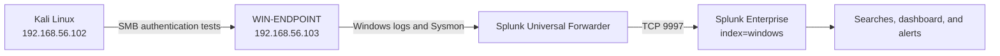
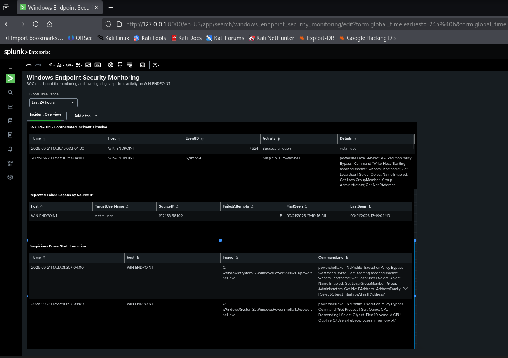

# Windows Endpoint Security Monitoring with Splunk and Sysmon

This project documents a controlled SOC investigation performed in a home lab. I built the environment, forwarded Windows telemetry to Splunk, simulated suspicious behaviors, investigated the resulting events, and converted the findings into dashboards and scheduled alerts.

The goal was not to reproduce malware. It was to practice the work an entry-level SOC analyst performs: collect logs, identify useful event IDs, correlate activity across sources, write SPL searches, validate detections, and preserve evidence.

## Lab architecture



## Environment

| Component | Purpose |
|---|---|
| Kali Linux | Splunk server, analyst workstation, and source of controlled failed-logon tests |
| Windows 11 `WIN-ENDPOINT` | Monitored endpoint |
| Sysmon | Process creation and enhanced endpoint telemetry |
| Splunk Universal Forwarder | Sent Windows event logs to Splunk |
| Splunk Enterprise 10.4.3 | Search, correlation, dashboarding, and alerting |
| VirtualBox host-only network | Isolated communication between the virtual machines |

## Scenario

The simulated incident included:

1. A successful logon to the test account `victim.user`.
2. PowerShell launched with `-ExecutionPolicy Bypass` for reconnaissance-style commands.
3. Creation of the local account `svc_backup`.
4. Addition of that account to the local `Administrators` group.
5. Creation of the scheduled task `Windows Update Check Service`.
6. Five failed SMB logons against `victim.user` from `192.168.56.102`.

All activity was performed inside an isolated lab that I own and control.

## Investigation results

| Finding | Evidence | Relevant telemetry |
|---|---|---|
| Repeated authentication failures | Five failed logons from `192.168.56.102` against `victim.user` | Security Event ID 4625 |
| Suspicious PowerShell execution | Process command line contained `ExecutionPolicy Bypass` | Sysmon Event ID 1 |
| Local account creation | `svc_backup` was created | Security Event ID 4720 |
| Privilege escalation / account manipulation | A local SID was added to `Administrators` | Security Event ID 4732 |
| Scheduled task persistence | `Windows Update Check Service` was created | Security Event ID 4698 |

## Detection engineering

I created and validated two scheduled alerts:

- **SOC - Repeated Failed Logons (5+)**: groups Event ID 4625 by host, target user, and source IP, then alerts when the count reaches five.
- **SOC - Suspicious PowerShell ExecutionPolicy Bypass**: identifies Sysmon process-creation events whose command line contains `ExecutionPolicy Bypass`.

The SPL files are available in [`detections/`](detections/). The first alert was validated with five SMB authentication failures. The second was validated by executing the controlled PowerShell command twice; Splunk returned two matching Sysmon events.

## Dashboard

The `Windows Endpoint Security Monitoring` dashboard contains a consolidated incident timeline, repeated failed logons grouped by source IP, and suspicious PowerShell process executions.



## Selected evidence

Only screenshots that prove a configuration milestone, simulated activity, detection, or alert result are included. Troubleshooting screens and failed intermediate attempts were intentionally excluded.

| Stage | Evidence |
|---|---|
| Log collection | [Windows data sources](evidence/screenshots/05-windows-data-ingestion.png) |
| Account and persistence simulation | [Scheduled task](evidence/screenshots/06-scheduled-task-persistence.png), [correlated account and task events](evidence/screenshots/10-account-and-task-events.png) |
| Failed logons | [Test execution](evidence/screenshots/07-failed-logon-test.png), [Splunk detection](evidence/screenshots/08-failed-logons-detected.png) |
| PowerShell | [Initial detection](evidence/screenshots/09-powershell-detected.png), [alert validation](evidence/screenshots/15-powershell-alert-results.png) |
| Alert validation | [Failed-logon trigger](evidence/screenshots/12-failed-logon-alert-triggered.png), [trigger results](evidence/screenshots/13-failed-logon-alert-results.png) |

## MITRE ATT&CK mapping

| Behavior | Technique |
|---|---|
| Repeated password attempts | T1110.001 - Password Guessing |
| PowerShell execution | T1059.001 - PowerShell |
| Local account creation | T1136.001 - Local Account |
| Account added to a privileged group | T1098 - Account Manipulation |
| Scheduled task creation | T1053.005 - Scheduled Task/Job: Scheduled Task |

## What I learned

- Windows logging must be configured before a SIEM can provide useful visibility.
- Event IDs identify categories of activity, but fields such as user, source IP, process image, and command line provide the investigative context.
- A search is not a finished detection until it has a clear threshold, schedule, and validation method.
- Testing from a second host produces more realistic network authentication telemetry than repeatedly testing locally.
- Troubleshooting is part of the investigation process. I had to validate networking, log forwarding, field extraction, time windows, and alert scheduling before the final detections worked.

## Repository contents

```text
docs/                         Incident report and Spanish learning guide
detections/                   SPL detection searches
evidence/screenshots/         Curated evidence only
data/                         Timeline and indicators
```

## Scope and limitations

This is a single-endpoint educational lab. The detections are intentionally transparent and should be tuned before production use. `ExecutionPolicy Bypass` can appear in legitimate administrative activity, and five failed logons alone do not prove malicious intent. In a production SOC I would enrich the results with asset criticality, user history, approved administration tools, additional network telemetry, and a documented response playbook.
